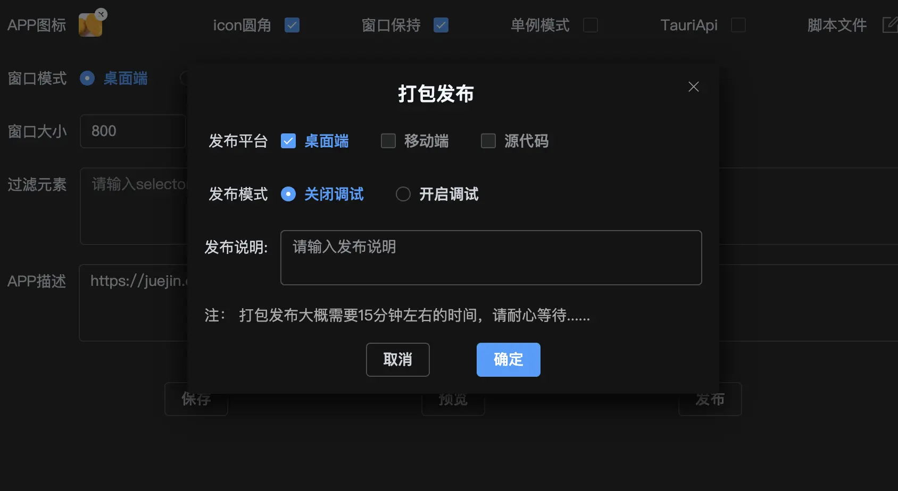
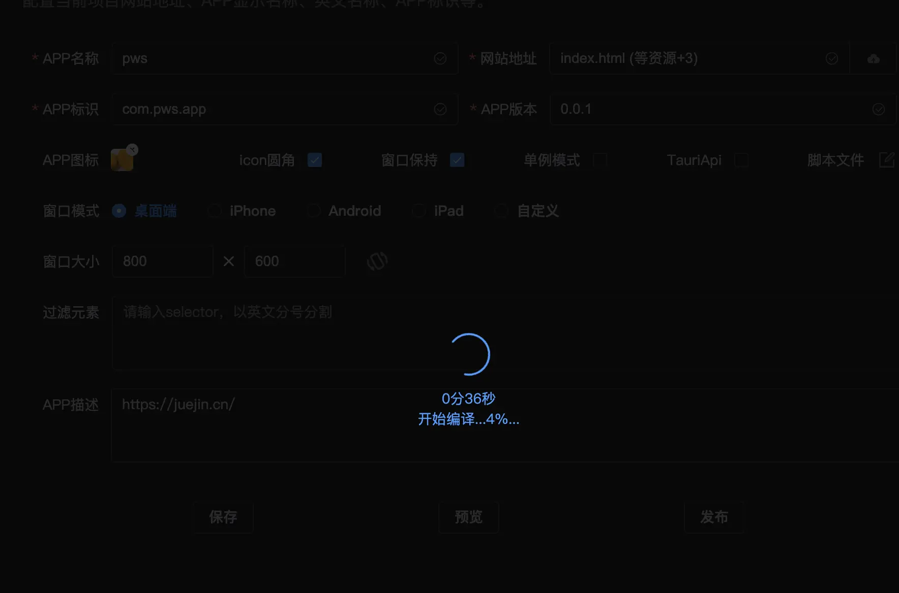
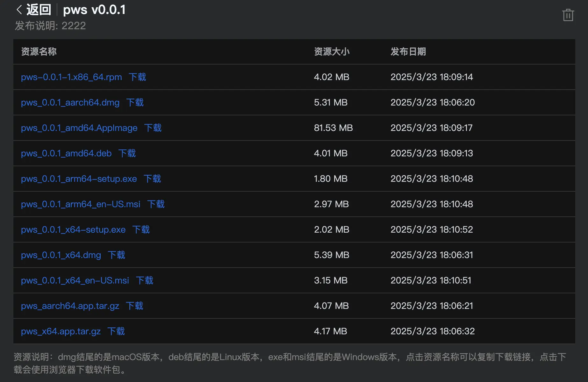

# Compilation and Release

This step instructs GitHub to compile your project into a cross-platform desktop application. Currently, PackPlus only supports desktop platforms (mobile support coming soon). You can choose between two release modes: 

1. **Release Mode (Debug Disabled)** - For production use
2. **Debug Mode** - Enables error logging in console when the app launches

You may optionally add release notes describing the changes in this version. After finalizing all configurations, click "Confirm" to begin the packaging process. The compilation typically takes about 10 minutes to complete...


The moment of truth (and the most error-prone stage):

```
Success or failure hangs in the balance
If successful: You'll be redirected to the download page to get your application
If failed: An error notification will appear in the upper right corner - either fix accordingly or contact us
```



## Successful Release:
Congratulations 🎉🎉🎉! Your application has been successfully compiled. Click "Download" to get your software, or click the name to copy the download link for browser access.


## Important Notes:
1. **Release Modes**: Debug mode enables error logging visible in console (right-click → Inspect to view)
2. **Release Notes**: Optional description of changes (can be skipped)
3. **Failed Releases**: A red warning icon appears top-right with error details for troubleshooting
4. **GitHub Build Failures**: Redirects to GitHub's build page with specific error messages
5. **Persistent Issues**: Contact us via WeChat: lanxingme or join our support group for assistance

(Note: All image paths have been updated from ../static to ../static as requested)