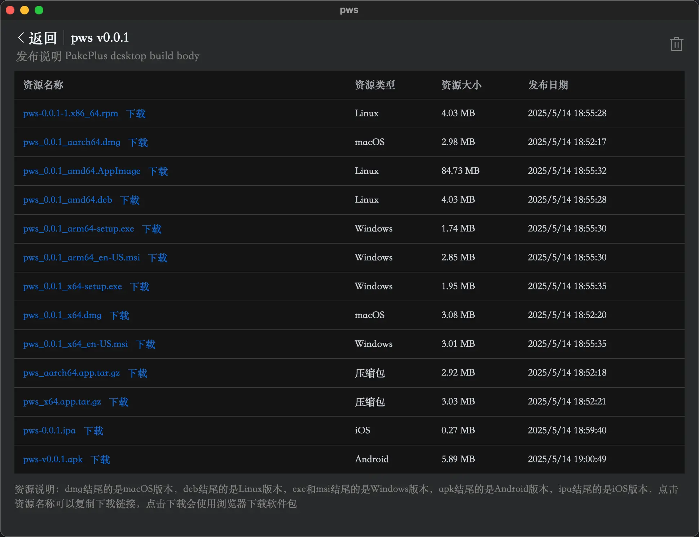

# 编译发布

这一步就是通知 github 将你的项目编译成跨平台的桌面软件。PakePlus 暂时只支持桌面端，所以这里只需要选择桌面端即可，移动端也会很快支持。发布模式可以选择关闭调试和开启调试，开启后，当软件启动时有问题可以在控制台看到错误信息。发布说明可以添加这次发布主要是哪些内容，可以忽略。一切配置完成后，点击确定，就可以开始打包了。需要耐心等待 8 分钟左右...


激动人心的等待时刻：(当然也是最容易出错的时刻)

```
成败在此一举
如果成功，跳转到发布页面，点击下载即可下载你的软件。
如果失败，又上角会有错误提示，可根据错误进行修改或联系我们。
```


## 发布成功：

恭喜你 🎉🎉🎉，你的软件已经编译成功了，点击下载即可下载你的软件。
或者点击名称会复制下载链接，然后在浏览器打开即可下载。



## 注意：

1. 发布模式：关闭调试和开启调试，开启后，当软件启动时有问题可以在控制台看到错误信息，页面可以右键打开检查查看调试信息。
2. 发布说明：可以添加这次发布主要是哪些内容，可以忽略。
3. 如果发布失败：又上角会出现一个红色的警告图标，点击后会提示错误信息，根据错误信息进行修复即可。
4. github 打包失败：会打开 github 的打包页面，根据错误信息进行修复即可。
5. 如果还是失败：请联系我们微信： lanxingme 或者加入群聊，我们会尽快帮你解决。
