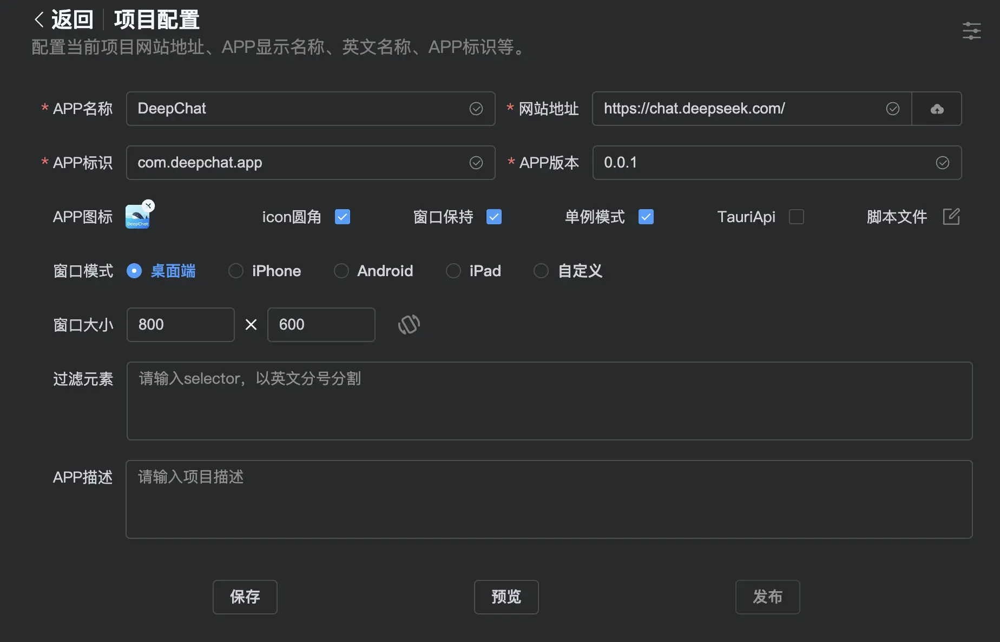

# Basic Configuration  

After creating your project, you'll need to configure some basic settings. These include your app name, the URL to package, the app identifier (ID), and the version number. The first four fields are required, while the rest can be configured based on your needs.  

- **App Name**: Supports Chinese, English, etc., but no spaces.  
- **Website URL**: Can be a local or web address, but must start with `http://` or `https://`. Alternatively, you can use a local HTML file or a `dist` folder from a Vue/React build.  
- **App ID**: A unique identifier for your software (cannot be duplicated across projects).  
- **Version Number**: Used to distinguish different versions of your app.  

  

After basic configuration, click the **Preview** button to see how your app will look. If everything is correct, click **Publish** to start packaging.  

---

### **Important Notes:**  

1. **App Name**: Supports Chinese, English, etc., but **no spaces**.  
2. **Website URL**:  
   - Can be a local or web address (must start with `http://` or `https://`).  
   - Can also be a local HTML file or a `dist` folder from Vue/React builds.  
   - **Single file size should not exceed 10MB** (due to GitHub restrictions). For large files (e.g., videos/images), use external links or compress them below 10MB.  
3. **App ID**: Must be **unique** (no duplicates).  
4. **Version Number**: Used to track app updates.  
5. **App Icon**:  
   - Supports local image uploads.  
   - macOS rounded corners option available.  
   - Defaults to PackPlus icon if not set.  
6. **Window Persistence**: Restores window size/position on relaunch.  
7. **Single Instance Mode**: Prevents multiple app instances.  
8. **Debug Mode**: Enables debugging in the preview window.  
9. **Tauri API**: Allows calling Tauri APIs from JavaScript.  
10. **Script File**:  
    - Supports custom JS injection (executes on app launch).  
    - **Warning**: Advanced feature (do not modify if unfamiliar with coding).  
11. **Window Mode**:  
    - Supports Desktop/iPhone/iPad/Android/Custom layouts.  
12. **Element Filtering**: Hides unwanted elements (e.g., ads) via CSS selectors.  
13. **App Description**: Briefly explain your app’s purpose.  
14. **Advanced Settings (Top-Right)**:  
    - Custom window configurations (refer to Tauri2 docs).  
    - **Warning**: Advanced feature (do not modify if unsure).  
15. **JSON Configuration**:  
    - Supports JSON-based customization (refer to Tauri2 docs).  
    - **Warning**: Advanced feature (do not modify if unsure).  
16. **Inject jQuery**:  
    - Adds jQuery support for DOM manipulation in scripts.  
    - **Warning**: Use with caution if unfamiliar with jQuery.  

---

### **Next Steps**  
- Click **Preview** to verify your app’s appearance.  
- Click **Publish** to start the packaging process.  
- For advanced settings, refer to the [Tauri2 documentation](#) (recommended for experienced users only).