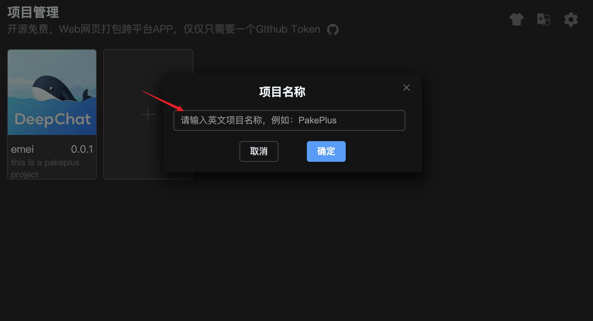

# Create Project

After obtaining and verifying your GitHub Token, you're ready to create a project. If you haven't obtained a Token or your Token is invalid, you can still create a temporary project locally. However, we strongly recommend following the Token acquisition steps to get your GitHub Token before proceeding.

## Steps to Create a Project

1. On the PakePlus homepage, click the `+` button to create a new project.
2. In the project creation popup, enter your project name and click the `Confirm` button to create the project.
3. After clicking `Confirm`, wait for the project creation to complete. You'll be automatically redirected to the project configuration page.

## Important Notes:

1. Project names cannot start with numbers.
2. Project names must be unique and cannot duplicate existing project names.
3. Project names can only contain letters, numbers, underscores, and hyphens. Spaces, Chinese characters, and special characters are not allowed.
