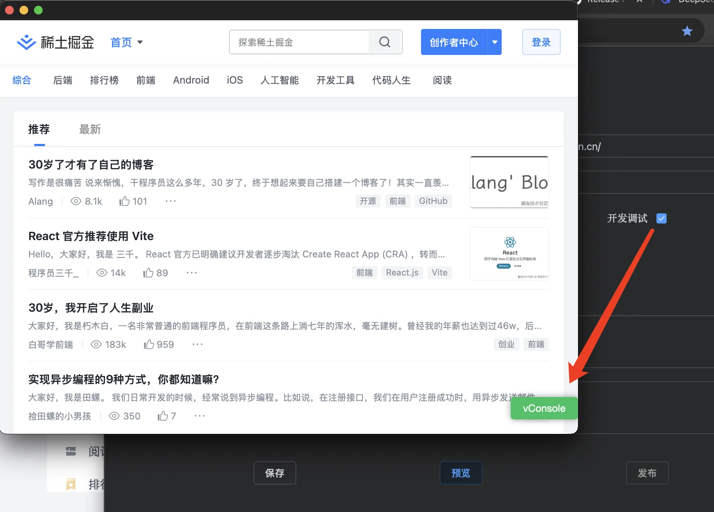

# Development Debugging

To enable development debugging, check the "Debug Mode" option and click "Preview". A debug button will appear in the lower right corner of the preview window - click it to start debugging.


# Release Modes

When publishing, you can choose between:
- **Release Mode** (Debug disabled) - For production use
- **Debug Mode** - Generates a debuggable version where right-clicking reveals "Inspect" options (identical to browser devtools)

Use debug mode to diagnose issues like blank screens or runtime errors. For troubleshooting assistance, consult DeepSeek or ChatGPT.

# CORS Configuration
Enabled by default. To disable cross-origin restrictions, add this browser argument:
```bash
--disable-web-security
```

# Advanced Configuration (Caution: Expert Only)
Refer to [Tauri2 Documentation](https://v2.tauri.app/reference/config/#windowconfig) for complete reference. Key parameters:

| Parameter | Type | Description |
|-----------|------|-------------|
| `acceptFirstMouse` | boolean | macOS click-through behavior for inactive windows |
| `additionalBrowserArgs` | string | Windows-only extra browser arguments |
| `alwaysOnTop` | boolean | Keep window above others |
| `backgroundColor` | Color | Window/WebView background (alpha channel varies by OS) |
| `devtools` | boolean | Enable browser devtools (requires flag in release builds) |
| `fullscreen` | boolean | Launch in fullscreen mode |
| `transparent` | boolean | Transparent window (macOS requires private-api flag) |
| `windowEffects` | object | Advanced visual effects (requires transparency) |

Platform-specific notes:
- Windows: Certain effects require workarounds when using decorations
- Linux: Limited support for shadows/visual effects
- Mobile: Several features unavailable on iOS/Android

> **Warning**: These are advanced nuclear options - modify only if you understand the consequences. Image paths updated to `../static` as requested.