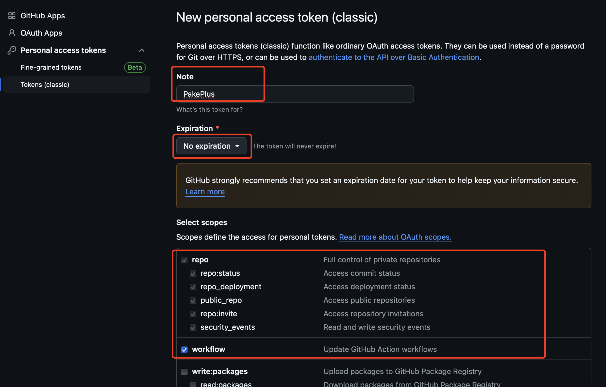
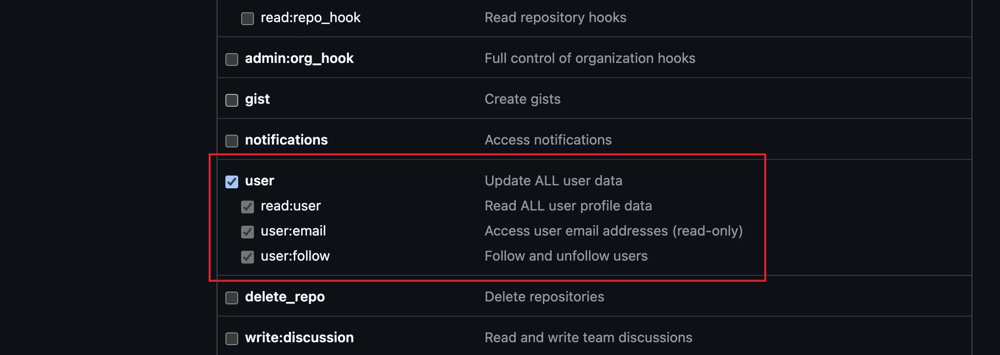
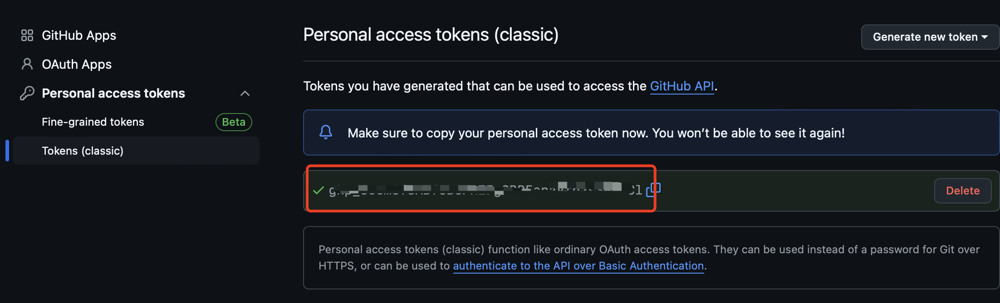
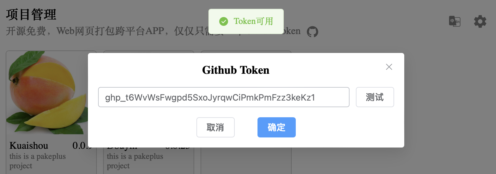

# Github Token packaging will soon no longer be supported. Please use local packaging instead

# Obtaining a Token

::: danger Token
Why do we need Github Token? Because this compilation and packaging process relies entirely on the GitHub platform, it is necessary to use GitHub tokens to operate these tasks. Github is an open platform where anyone can create an account and obtain permanently free tokens. Thank you very much for the free service provided by Github. Obtaining a token is also very simple. For those who do not have an account, first register a GitHub account, and then go to the personal center to create a token.

When using this software, please comply with relevant laws and regulations. If you use GitHub
When using tokens in this project, the project will be flagged by default, and the compilation results of the project will be counted for success or failure, in order to improve the project and obtain feedback. Packaging is for personal use only and should not be disseminated or used for commercial purposes. The packaged resources will be stored in your own Github open source repository and can be viewed by anyone. Therefore, please strictly follow the Github usage guidelines, otherwise you will be responsible for any consequences.
:::

Why do you need a GitHub Token? Because the entire compilation and packaging process relies on the GitHub platform, a GitHub token is required to perform these operations. GitHub is an open platform where anyone can create an account and obtain a permanently free token. We sincerely appreciate GitHub's free services. Obtaining a token is simple—if you don't have an account, register one first, then create a token in your personal settings.

## Steps to Register on GitHub

1. Visit the GitHub homepage: [https://github.com/](https://github.com/)
2. Click the `Sign up` button in the top-right corner to go to the registration page.
3. Fill in your registration details, including username, email, password, etc.
4. Click the `Sign up for GitHub` button to complete registration.

## Steps to Create a Token

```
Token Permission Requirements:
All repositories: Required to fork the original template repository
Actions: Used to execute GitHub Actions for packaging and compilation
Administration: Required for forking repositories and file management
Contents: Allows adding/deleting/modifying/searching files in the PackPlus repository
Issues: Enables submitting compilation errors or other issues to PackPlus
Workflows: Used to compile and package your software
```

1. Log in to your GitHub account.
2. Click your profile picture in the top-right corner to go to your personal dashboard.
3. Click the `Settings` button to enter the settings page.
4. In the left-hand menu, click `Developer settings` to access developer options.
5. In the left-hand menu, click `Personal access tokens` to go to the token management page.
6. Click `Generate new token` to create a new token.
   GitHub offers two types of tokens—either will work. Use the links below to go directly:
   [Personal access tokens (classic)](https://github.com/settings/tokens)
   or
   [Fine-grained personal access tokens](https://github.com/settings/personal-access-tokens).

7. **For Personal access tokens (classic):**
   Simply check the following three permissions: <font color="red">repo, workflow, and user</font>.
   
   
   Then copy the generated token into PackPlus:
   

8. **Test the Token**
   Open PackPlus, click the settings button in the top-right corner, paste the token obtained in Step 7 or 8, and click "Test." If it shows "Token is valid," you're all set!
   

## Important Notes

-   You can only view the token once after generation—**keep it secure**.
-   The token should **only be stored locally on your computer**—do not share it.
-   If you set an expiration date, the token will only work within its validity period. You’ll need to generate a new one after it expires.
