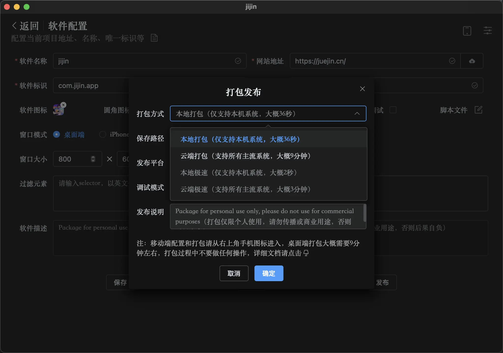

# 本地打包

::: danger 注意
本地打包并不是很稳定，本地不支持单例模式，不支持移动端打包，不支持保存到中文路径，必须和 config 文件夹一起使用，而且静态文件本地打包不会保持 cookie/localstorage 状态，最好本地测试没问题后，使用线上打包的方式。
:::

本地发布模式支持在本地不联网的情况下打包发布，并且也不用安装任何环境，而且打包时间仅需 30 秒左右，不受文件大小和数量限制，也不受打包时间限制，但是并不推荐正式使用，因为本地打包不支持单例模式，不支持窗口状态保持，体积也要比云端打包大，仅支持 Windowsx64 和 mac 端本地打包，暂不支持打包移动端。而且并不稳定，优先推荐使用云端打包。

## 注意：

1. 发布模式：关闭调试和开启调试，开启后，当软件启动时有问题可以在控制台看到错误信息，页面可以右键打开检查查看调试信息。
2. 发布说明：可以添加这次发布主要是哪些内容，可以忽略。
3. 如果发布失败：又上角会出现一个红色的警告图标，点击后会提示错误信息，根据错误信息进行修复即可。
4. github 打包失败：会打开 github 的打包页面，根据错误信息进行修复即可。
5. 打包方式的不同和差异：

-   本地打包也不需要安装任何环境，也不用配置 token，简直是太牛逼了（但仅支持 windowsX64 和 mac 两个平台）
-   本地打包：没有打包次数限制，打包速度快，缺点很多，比如仅支持本机系统，打包体积大，不支持单例和状态保持等
-   云端打包：支持所有主流操作系统，打包体积小（5M 左右），缺点是打包速度慢，有打包时间限制
-   本地极速：没有次数限制，速度快，体积小，支持所有主流系统，待开发.....
-   云端极速：支持所有主流系统，体积小，时间快，时间限制放宽，待开发.....

6. 发布平台的不同和差异：

-   windows：主流操作系统，有 x86_32 和 x64 和 arm 架构区别，x64 市场最广，注意选择适合自己的系统
-   macos：主流操作系统，有 x64 和 arm（m 芯片）架构区别，m 架构好像兼容 x64 版本，优先选择 arm 架构
-   linux：非主流操作系统，有 x64 和 Amd64 和 arm 架构区别，x64 的市场最广，注意选择适合自己的系统
-   x64 版本的包一般在名称中都包含 x64 关键字，包含 arm 和 aarch64 关键词的名称一般都是 arm 新品的安装包

7.  保存路径：本地打包需要先设置好保存路径，如果不设置默认存储到下载路径，点击输入框可以输入路径和选择保存路径。
8.  如还是失败：可以加入我们群聊咨询相关问题[社区群聊](../exchange/index.md)，我们会尽快帮你解决。
