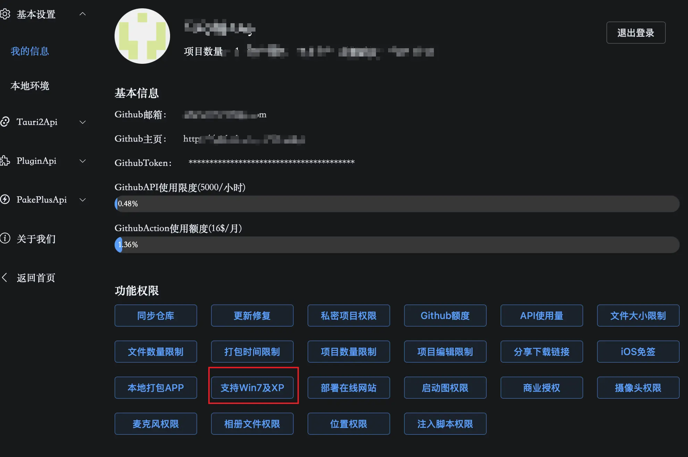
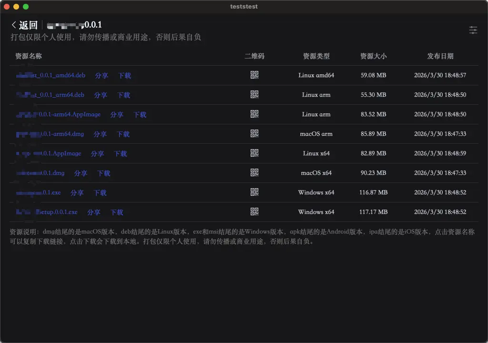

# Electron 版本

Electron 版本最大的优势就是支持 win7 和国产统信、麒麟等 linux arm 系统，并且支持各个平台的 UI 可以保持一致，而且相对比较稳定，功能完全类似浏览器，完美兼容各类 API，例如下载保存文件提示等，如果用 tauri 则需要自己写代码来实现这些下载逻辑。但是缺点就是体积比较大，windows 平台体积在 120M 左右，mac 和 linux 体积在 80M 左右。

## 使用说明

开通权限后，需要到个人中心点击 支持 Win7 及 XP 按钮，查看使用说明以及同意使用:

才可以创建新项目，发布时选择 Electron，才支持 Win7 及国产系统的选项:

点击发布后，大概 3 分钟左右就可以得到安装包，并下载使用：

其中 exe 结尾的就是支持 win7 和 xp 系统的包，带 Setup 的是安装包，不带 Setup 的绿色免安装版本。arm64.dep 结尾的就是支持国产系统的安装包，例如麒麟、统信等系统。
