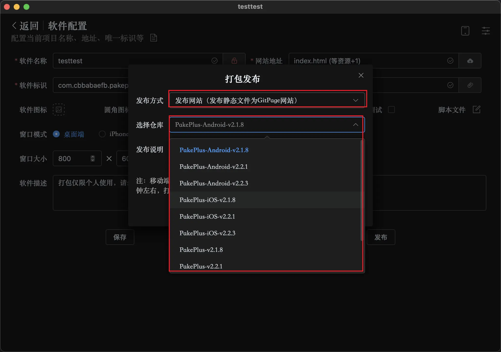
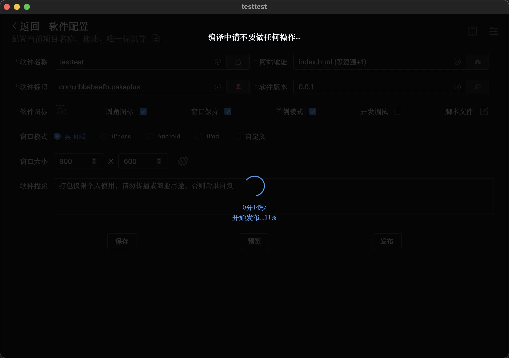
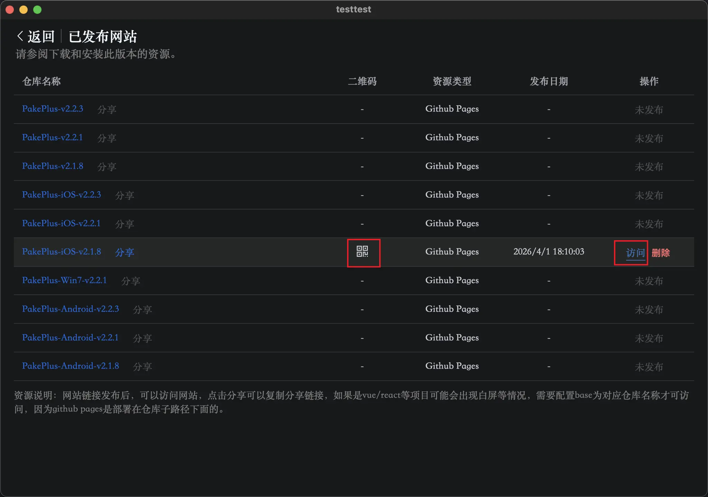

# 发布在线网站

PakePlus 现在支持将静态文件发布为在线网站了，无论你是 html 代码，还是用 vue、react 等框架写的代码，只要最后都编译为 html 代码，就都可以发布为在线网站了，并且是全球可访问永久免费，因为它使用的是 github pages 发布的，所以不用担心跑路，因为后台够硬。可以观看视频教程：[PakePlus 可免费发布 vue/react/html 为在线网站了](https://www.bilibili.com/video/BV1WBADz3Ex8/?spm_id_from=333.1387.upload.video_card.click)

## 创建项目

正常创建一个项目，配置好软件名称，选中你的静态文件夹，点击发布，选中在线网站，并选中一个仓库发布：

发布大概需要 50 秒左右：

就可以跳转到发布页面，然后点击分享或者扫描二维码，或者点击访问都可以快速访问：

## 注意

Github Pages 虽然可以全球访问并且永久免费，但是国内访问速度可能并不是很快，可以使用绿色上网工具可能会快很多。
如果你是使用 vue 或 react 框架写的项目，需要配置 base 为发布时选中的仓库名称，例如：./PakePlus-iOS-v2.1.8，否则可能会出现打开白屏等情况。
