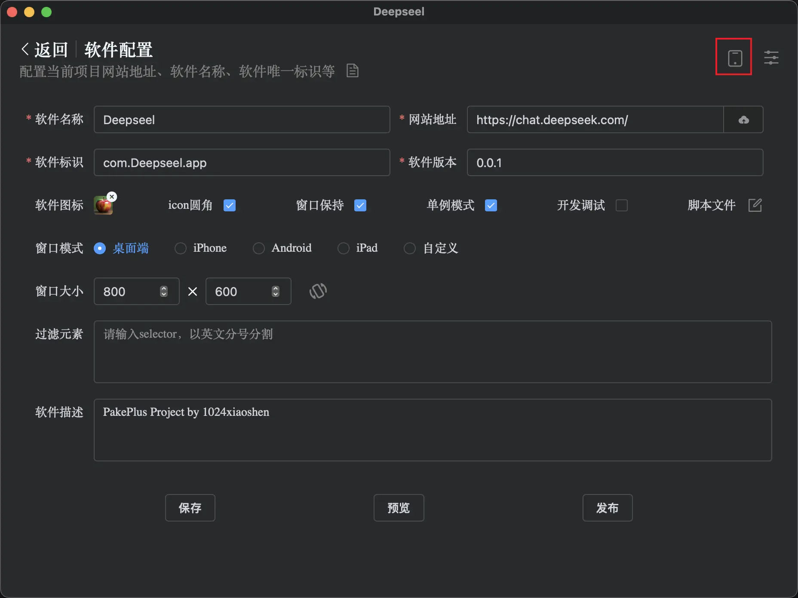
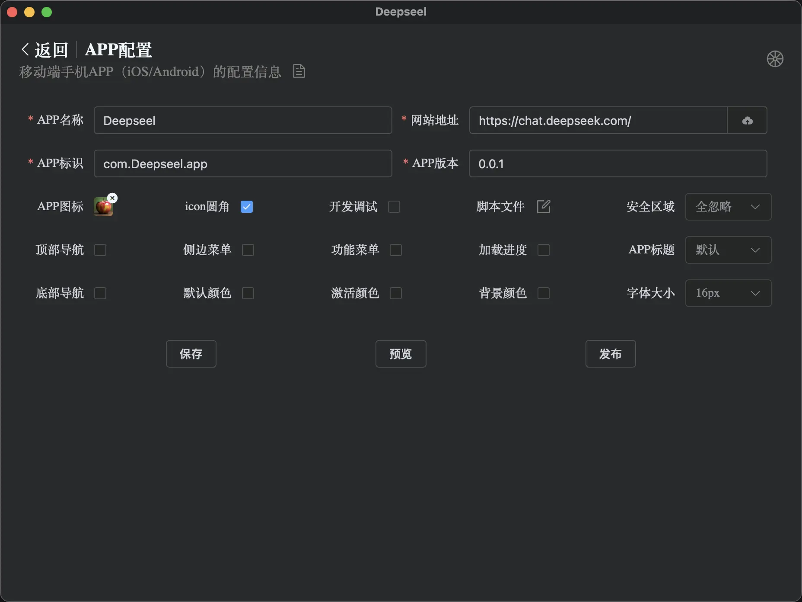
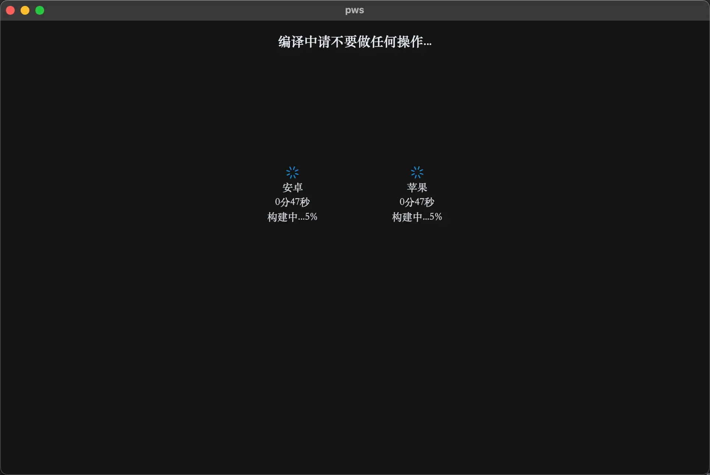
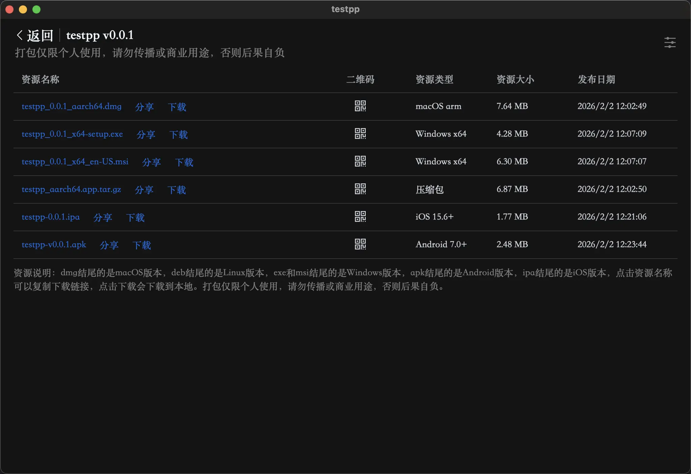

# APP 配置

手机 APP 暂时只支持 Android 和 iOS 系统，后面可能会迭代开发支持更多系统。

<BiliBili src="//player.bilibili.com/player.html?isOutside=true&aid=114591589731347&bvid=BV1wb75zrEBh&cid=30216618986&p=1"/>

点击软件配置界面右上角的手机图标，即可进入移动端配置界面。



移动端配置与桌面端配置类似，后续会支持更多平台。
以界面上展示的配置为准，因为正在开发移动端的配置，所以会有一些配置项还没有完善。
移动端支持打包 web 网站，也支持静态文件，静态文件点击上传包含 index.html 文件的文件夹。



激动人心的等待时刻：(当然也是最容易出错的时刻，需要耐心等待 3 分钟左右)

```
成败在此一举
如果成功，跳转到发布页面，点击下载即可下载你的软件。
如果失败，又上角会有错误提示，可根据错误进行修改或联系我们。
```



## 发布成功：

恭喜你 🎉🎉🎉，你的软件已经编译成功了，点击 apk 下载 android 版本，点击 ipa 下载 ios 版本。
或者点击名称会复制下载链接，然后在浏览器打开即可下载。



## 注意事项

-   ios 仅支持 15.6 版本以上系统
-   android 仅支持 7.0 版本以上系统
-   iOS 免签是安装描述文件的方式安装类 APP
-   安装说明文档：[ipa/apk 安装说明](../question/phone.md)

<script setup>
import BiliBili from "../../components/bilibili.vue"
</script>
