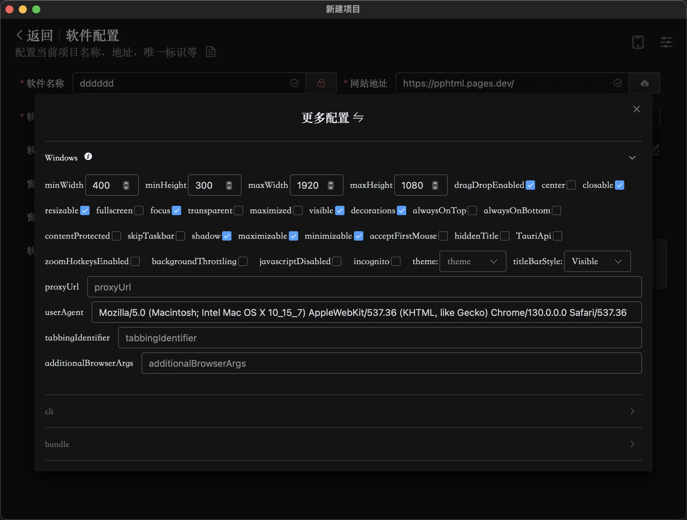
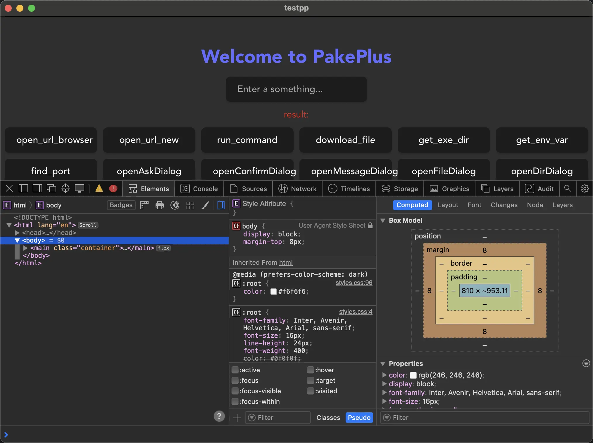
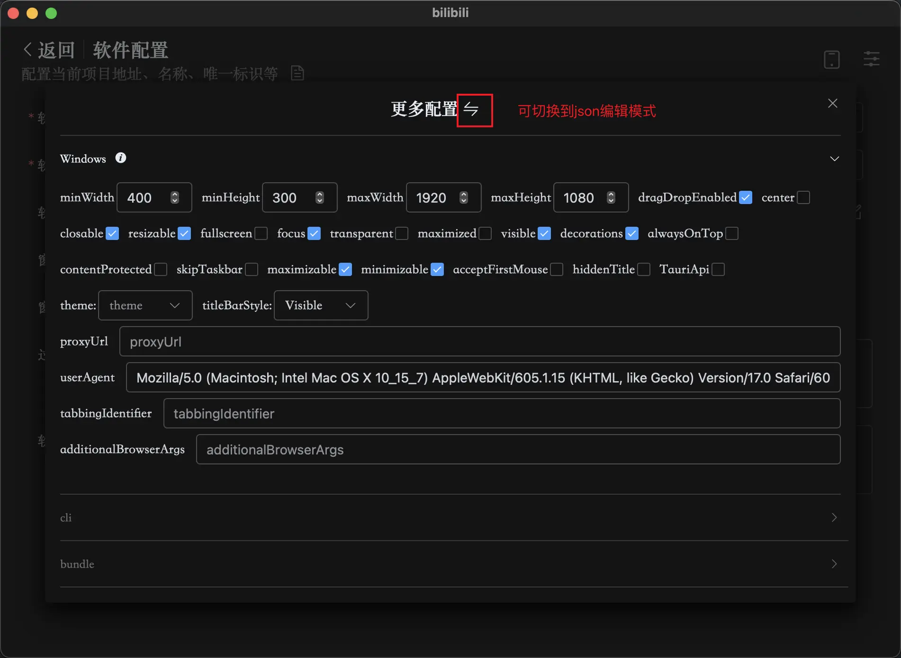

# 桌面端配置

这里主要将 tauri 的配置可视化了，直接通过点击或者下拉操作即可实现自定义配置，比如全屏显示，或者开启调试模式等，如果你要使用桌面端相关的 APi，一定要勾选 TauriApi 这个选项，否则不生效！

## 开发调试

如果你需要开发调试，可以勾选开发调试选项，然后点击预览，就可以在预览窗口右下角看到调试按钮，点击即可调试。

## 发布模式

在点击发布的时候，可以选择开启调试和关闭调试，如果开启调试，那么就会生成一个调试版本的应用，等发布成功后，安装后，点击右键可以看到有检查调试的选项，点击即可检查调试。这个调试和浏览器的调试一样。如果你的项目发布之后，出现白屏或者打开报错等问题，就可以通过这种方式来查看问题原因，然后根据问题描述来解决问题。可以通过 DeepSeek 或者 ChatGPT 来解决问题。

## 更多配置

这是核弹工厂，不懂不要碰。
更多配置请见 tauri2 文档。文档地址：[tauri2 文档](https://v2.tauri.app/reference/config/#windowconfig)  
配置项说明(最终以 tauri2 官方为准)，切换到 json 模式可以增删改更多可编辑属性。

acceptFirstMouse: boolean 
是否在macOS上点击非活动窗口时同时点击穿透到网页视图。

additionalBrowserArgs: string | null 
在Windows上定义额外的浏览器参数。默认情况下wry会传递–disable-features=msWebOOUI,msPdfOOUI,msSmartScreenProtection参数，如果使用此方法，需要自行禁用这些组件。

alwaysOnBottom: boolean 
窗口是否应始终位于其他窗口下方。

alwaysOnTop: boolean 
窗口是否应始终位于其他窗口上方。

backgroundColor: Color | null 
设置窗口和网页视图的背景颜色。 
平台特定说明： 
Windows：窗口层忽略alpha通道。 
Windows 7：网页视图层忽略alpha通道。 
Windows 8+：如果alpha通道不为0，网页视图层将忽略它。

backgroundThrottling: BackgroundThrottlingPolicy | null 
更改默认的后台节流行为。 
默认情况下，浏览器使用暂停策略，在视图最小化或隐藏约5分钟后，会节流计时器甚至卸载整个标签页以释放资源。

browserExtensionsEnabled: boolean 
是否可以为网页视图进程安装浏览器扩展。 
平台特定说明： 
Windows：启用WebView2环境的AreBrowserExtensionsEnabled。 
MacOS/Linux/iOS/Android：不支持。

center: boolean 
窗口启动时是否居中。

closable: boolean 
窗口的原生关闭按钮是否启用。 
平台特定说明： 
Linux：“GTK+会尽力说服窗口管理器不显示关闭按钮。” 
iOS/Android：不支持。 
默认值：true

contentProtected: boolean 
防止窗口内容被其他应用程序捕获。

create: boolean 
Tauri是否应在应用启动时创建此窗口。 
当设置为false时，必须手动通过app.config().app.windows获取配置对象并使用WebviewWindowBuilder::from_config创建。 
默认值：true

decorations: boolean 
窗口是否应有边框和栏。 
默认值：true

devtools: boolean | null 
启用通常称为浏览器开发者工具的网页检查器。默认启用。 
此API在调试版本中有效，但在发布版本中需要devtools功能标志才能启用。

dragDropEnabled: boolean 
网页视图上是否启用拖放。默认启用。如果想要网页元素可以拖拽，请将其关闭 
在Windows上禁用此功能才能在前端使用HTML5拖放。 
默认值：true

focus: boolean 
窗口初始时是否获得焦点。 
默认值：true

fullscreen: boolean 
窗口启动时是否为全屏。不会保留最大化最小化和关闭按钮和标题栏，甚至会覆盖任务栏。要关闭软件的时候，需要打开任务管理器来关闭。

height: number (double格式) 
窗口高度。 
默认值：600

hiddenTitle: boolean 
如果为true，在macOS上隐藏窗口标题。

incognito: boolean 
网页视图是否应在隐身模式下启动。 
平台特定说明： 
Android：不支持。

label: string 
窗口标识符。必须为字母数字。 
默认值：“main”

maxHeight: number | null (double格式) 
窗口最大高度。

maximizable: boolean 
窗口的原生最大化按钮是否启用。如果resizable设置为false，则忽略此设置。 
平台特定说明： 
macOS：禁用窗口标题栏中的&quot;缩放&quot;按钮。 
Linux/iOS/Android：不支持。 
默认值：true

maximized: boolean 
窗口是否最大化。会保留最大化最小化和关闭按钮和标题栏。

maxWidth: number | null (double格式) 
窗口最大宽度。

minHeight: number | null (double格式) 
窗口最小高度。

minimizable: boolean 
窗口的原生最小化按钮是否启用。 
平台特定说明： 
Linux/iOS/Android：不支持。 
默认值：true

minWidth: number | null (double格式) 
窗口最小宽度。

parent: string | null 
设置与此标签关联的窗口作为要创建窗口的父窗口。

proxyUrl: string | null (uri格式) 
网页视图所有网络请求的代理URL。 
必须是http://或socks5:// URL。 
平台特定说明： 
macOS：需要macos-proxy功能标志，仅适用于macOS 14+。

resizable: boolean 
窗口是否可调整大小。当resizable设置为false时，原生窗口的最大化按钮自动禁用。 
默认值：true

shadow: boolean 
窗口是否有阴影。 
平台特定说明： 
Windows：false对装饰窗口无效，阴影始终开启。 
Linux：不支持。 
默认值：true

skipTaskbar: boolean 
如果为true，在Windows和Linux上从任务栏隐藏窗口图标。

tabbingIdentifier: string | null 
为macOS定义窗口标签标识符。 
具有匹配标签标识符的窗口将分组在一起。如果未设置标签标识符，则禁用自动标签。

theme: Theme | null 
初始窗口主题。默认为系统主题。仅在Windows和macOS 10.14+上实现。

title: string 
窗口标题。 
默认值：“Tauri App”

titleBarStyle: TitleBarStyle 
macOS标题栏的样式。 
默认值：“Visible”

transparent: boolean 
窗口是否透明。 
注意：在macOS上，这需要macos-private-api功能标志。

url: WebviewUrl 
窗口网页视图URL。 
默认值：“index.html”

useHttpsScheme: boolean 
设置自定义协议在Windows和Android上是否使用https://&lt;scheme&gt;.localhost而不是默认的http://&lt;scheme&gt;.localhost。默认为false。

userAgent: string | null 
网页视图的用户代理。

visible: boolean 
窗口是否可见。 
默认值：true

visibleOnAllWorkspaces: boolean 
窗口是否应在所有工作区或虚拟桌面上可见。 
平台特定说明： 
Windows/iOS/Android：不支持。

width: number (double格式) 
窗口宽度。 
默认值：800

windowClassname: string | null 
在Windows上创建窗口时创建的窗口类名。仅限Windows。

windowEffects: WindowEffectsConfig | null 
窗口效果。 
要求窗口透明。 
平台特定说明： 
Windows：如果使用装饰或阴影，可能需要尝试此解决方法。

x: number | null (double格式) 
窗口左上角的水平位置。

y: number | null (double格式) 
窗口左上角的垂直位置。

zoomHotkeysEnabled: boolean 
是否通过热键启用页面缩放。 
平台特定说明： 
Windows：控制WebView2的IsZoomControlEnabled设置。 
MacOS/Linux：注入一个polyfill，使用ctrl/command + -/=缩放，每步20%，范围从20%到1000%。 
Android/iOS：不支持。

