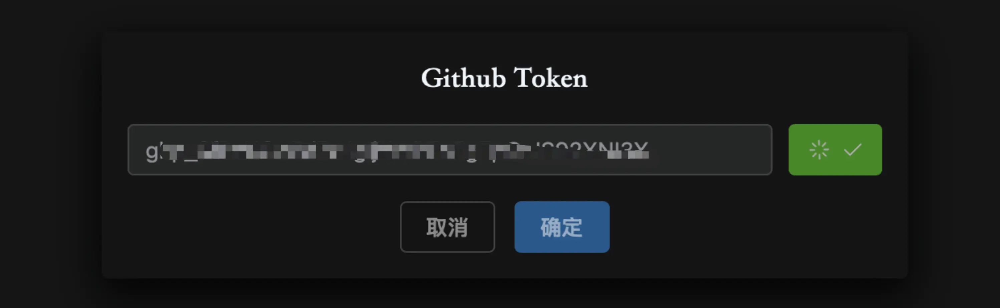
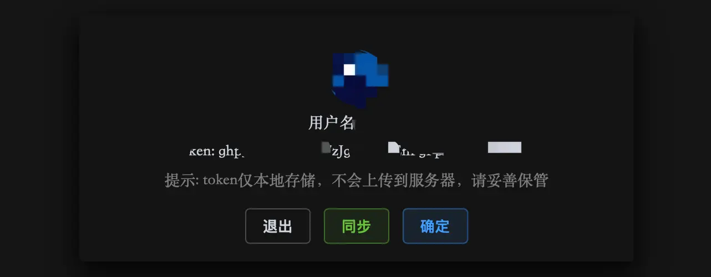

# 获取 Token

为什么要 Github Token？因为这个编译和打包流程全部依托在 github 平台上进行，所以需要使用 github token 来操作这些事情。Github 是一个开放的平台，任何人都可以创建账号，并获取到永久免费的 token。这里非常感谢 Github 提供的免费服务。获取 token 也很简单，没有账号的先注册一个 github 账号，然后到个人中心里面就可以创建 token。

## 注册 Github 步骤

1. 打开 Github 官网：https://github.com/
2. 点击右上角的 `Sign up` 按钮，进入注册页面。
3. 填写注册信息，包括用户名、邮箱、密码等。
4. 点击 `Sign up for Github` 按钮，完成注册。

## 创建 Token 步骤

```
token 权限说明：
All repositories：要 fork 一个原始模板仓库
Actions：操作 github action进行打包编译
Administration：对仓库进行 fork 和文件管理
Contents：对PakePlus仓库进行添加/删除/修改/查找等操作
Issues：向 PakePlus 提交编译错误等问题
Workflows：用来编译打包你的软件
```

1. 登录 Github 账号。
2. 点击右上角的头像，进入个人中心。
3. 点击 `Settings` 按钮，进入设置页面。
4. 在左侧菜单中，点击 `Developer settings` 按钮，进入开发者设置页面。
5. 在左侧菜单中，点击 `Personal access tokens` 按钮，进入个人访问令牌页面。
6. 点击 `Generate new token` 按钮，进入生成新令牌页面。  
   github 提供两种 token 类型，任意一种都可以，点击下面链接直达:  
   [Personal access tokens (classic)](https://github.com/settings/tokens)
   或者  
   [Fine-grained personal access tokens](https://github.com/settings/personal-access-tokens) 。
7. Personal access tokens (classic) 获取操作：  
   只需要勾选下面三个权限就可以了：<font color="red">repo 和 workflow 和 user</font>

    
      
    然后将得到的 token 复制到 PakePlus 就可以了：

    

8. <font color="red">(如果你通过第 7 步已经拿到了 token 就不用操作这个步骤了，直接看第 9 步)</font>
   Fine-grained personal access tokens 获取操作：

      
    Generate new token：添写一个 token 的名字，然后选择过期时间为不过期，描述随便写，然后选择 All
    repositories

    

    配置权限：赋予红框标注的权限，Access 选择:&nbsp;&nbsp;Read
    and write&nbsp;

    
    
    
    

    然后点击最底部的 Generate token 就可以拿到 token 了：

    

    然后把 Token 复制到 PakePlus 里，就可以使用了：

    

9. 测试 Token 是否正确  
   打开 PakePlus，点击首页右上角的设置按钮，把第 7 步或者第 8 步得到的 token 复制进去，点击测试，会校验 token 是否正确并初始化，网络好的话转20秒左右就好了:

    

    如果提示 Token 可用，说明成功了，并会展示 github 信息：

    

    如果提示 Token 不可用或一直在转圈圈，可能 token 不正确或网络不好，需要重新获取 token，然后再试。


## 注意事项

-   github 生成的 token 只有一次机会查看，请妥善保管。
-   PakePlus 填入的 token 只会仅存储在你电脑本地，请妥善保管。
-   生成的 token 只能在有效期内使用(如果你设置的是有效期模式)，过期后需要重新生成。
-   当你填入 token 并验证成功后，会在右上角展示你的 github 头像，点击头像可以查看你的 github 昵称和 token，点击头像会跳转到你的 github 个人主页，点击 token 会将 token 复制到你的粘贴板。如果在使用过程中有遇到问题，[可以进交流群咨询](../exchange/index.md)。
