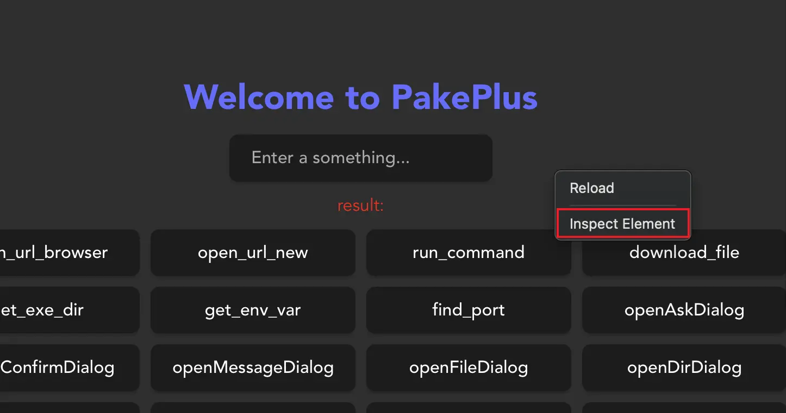
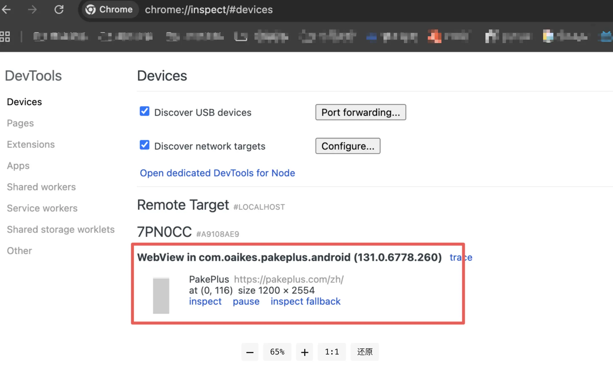
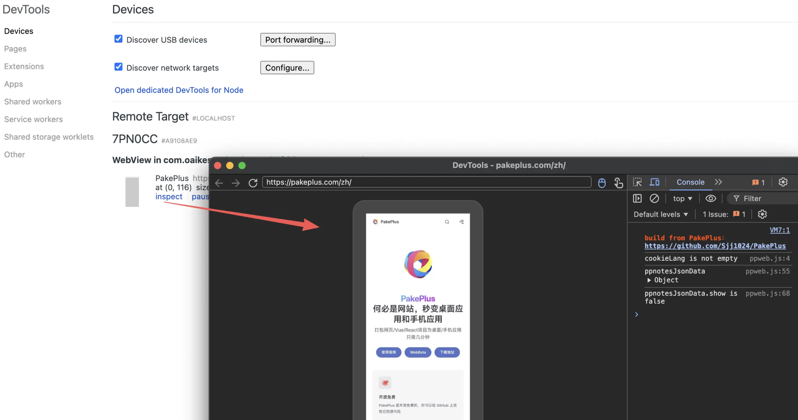
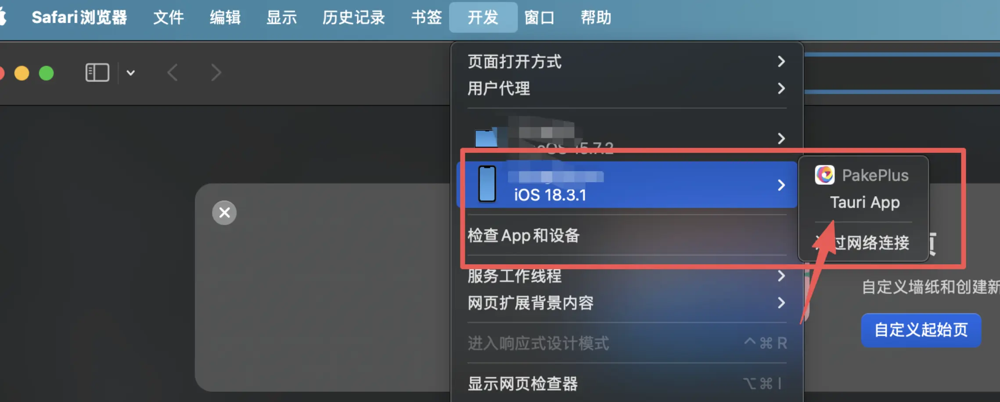
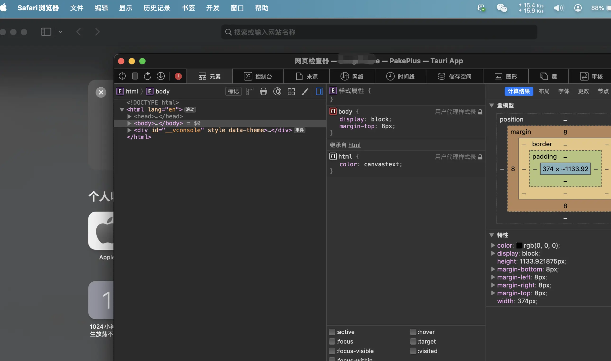

# 桌面端调试

如果你需要开发调试，可以勾选开发调试选项，然后点击预览，就可以在预览窗口右下角看到调试按钮，点击即可调试。


在发布模式开启调试之后，就可以像浏览器一样右键打开调试：



# 移动端调试

发布版本中可以开启移动端调试，选择开启调试后，等安装到移动端就可以连接电脑进行调试。

## 安卓调试

安卓连接电脑后，只需要打开 chrome 浏览器，输入：

```
chrome://inspect
```



选中找到的 app，就会出现像网站一样的调试页面：



## iOS 调试

ios 连接 mac 后，打开 safari 浏览器，在工具栏开发 -> 找到自己的设备 -> 对应的 APP：



选中之后就可以打开一个 web 调试界面：


