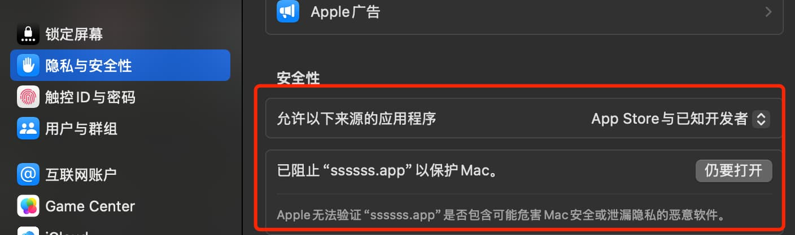

# 问题自查

如果有遇到问题，自查往往更有效果。

1. 到 PP issue 中自查，往往有效果：https://github.com/Sjj1024/PackPlus/issues
2. 检查自己是否修改过配置或脚本文件，用最原始的配置试试
3. 检查 token 权限是否给正确了，或者重新填写 token 再试试(不要手动创建 PackPlus/PackPlus-Android/PackPlus-iOS 同名的仓库)
4. 是否有在群里咨询过，没有的话，先在群里问问试试，[进群交流](../exchange/index.md)
5. 网络问题请检查是否使用了代理或者云电脑等，可以尝试开关代理或切换网络试试。
6. 如果某些功能没有支持，可以通过赞助 PP 快速优先开发解决。
7. windows 用户请卸载掉流氓软件，比如 360 等国产监控软件，否则遇到问题请自己解决

## mac 提示 应用已随坏


这是因为没有给苹果给钱，所以苹果会拒绝你的应用。

解决办法：

1. **Mac 用户可能在安装时看到“应用已损坏”的警告。** 请点击“取消”，然后运行以下命令，再重新打开应用：(这是由于应用需要官方签名，才能避免安装后弹出“应用已损坏”的提示，但官方签名的费用每年 99 美元...因此，需要手动绕过签名以正常使用)

```sh
sudo xattr -r -d com.apple.quarantine /Applications/PackPlus.app
```

2. **当你打包应用时，Mac 用户可能在安装时看到“应用已损坏”的警告。** 请点击“取消”，然后运行以下命令，输入电脑密码，再重新打开应用：

```sh
sudo xattr -r -d com.apple.quarantine /Applications/你的软件名称.app
```

3. 或到系统设置 > 隐私与安全 > 安全性 > 仍要打开，就可以了



## windows 提示无法在你电脑上运行


这是因为你下载错版本了，你的电脑是 x64 位的就不要下载 arm 版本的，反之亦然。查看自己电脑是什么版本的可以查看电脑属性，也可以在电脑左下角搜索“系统”，然后点击“关于”，可以看到电脑的系统信息，百度一下就知道了。

x64 位的下载下面两个结尾的文件：

-   x64-setup.exe
-   x64-setup.exe.sig

arm64 位下载下面两个结尾的文件：

-   \_arm64-setup.exe
-   \_arm64-setup.exe.sig

## 请注意 Github 账户免费额度

如果打包失败，并提示：

> The job was not started because recent account payments have failed or your spending limit needs to be increased. Please check the 'Billing & plans' section in your settings

说明你白嫖 Github 过渡，需要支付刀乐才可以使用了。  
主意：每个 Github 每月有免费 2,000 分钟 action 使用额度，大约 16 刀，用超了就需要付费了！为了保证账户可用，PackPlus 将会检测到账户使用达到上限之前，禁止使用，直到下个月恢复额度才可以使用。

## 无法拖拽文件或元素拖动

原因：[https://v2.tauri.app/reference/config/#dragdropenabled](https://v2.tauri.app/reference/config/#dragdropenabled)  
解决办法：  
mac 平台: 在更多配置中，关闭 dragDropEnabled 选项，然后重新打包。
windows 平台: 在更多配置中，开启 dragDropEnabled 选项，然后重新打包。

## 打包后白屏或报错

打一个测试包，然后右键检查元素看一下是否有报错，有报错根据报错信息解决即可。
如果看不懂报错信息或无法解决，可以进群交流。推荐可以试试 deepseek 是否可以帮你解决问题。

## 窗口置顶

在更多配置中，开启 alwaysOnTop 即可

## 全屏模式

在更多配置中，开启 fullscreen 即可

## dispatch 错误: 404/422/403 等等错误

确认 token 权限是否配置正确，然后重新填入 token 试试，往往是 token 权限配置错误导致的。或者点击首页头像然后同步一下试试。

## Cannot read properties of undefined XXX

> PackPlus publish action error undefined 等等问题

用最新版本的 PackPlus，然后填入 token 试试，能解决 99%的问题。或者点击首页头像然后同步一下试试。

## 网络请求失败，请检查网络再试!

当你遇到这个问题的时候，在浏览器中输入：https://api.github.com，如果有返回一段json说明你的网络是没有问题的。
如果报错 403/443 等或者打不开，那就是你的网络服务商把 github 的接口地址屏蔽了，请科学上网或者换一个网络服务商。
或者关掉所有杀毒软件！群里就有人遇到过这种情况，然后关掉杀毒软件就好了。顺便说一句：360 等流氓软件就不要用了，不但会监控你的电脑，还会上报你的浏览信息，这是非常不道德的行为。

## 打包后的软件页面跳转

在打包后的软件中，可以点击页面右键，有 back 按钮，就是返回，有 forword 按钮，就是前进。
就像浏览器中的前进后退按钮一样。也可以通过注入 js 脚本，来实现给页面添加前进后退按钮或快捷键，这类问题直接问 ai 即可。

## 打包后页面缩放不正确

默认使用的是标准的电脑显示比例，如何打开之后和你在网页中不一致，请确认你的网页是否进行了缩放，你的电脑屏幕分辨率是否设置正确。
