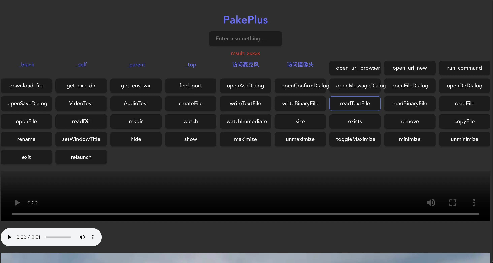
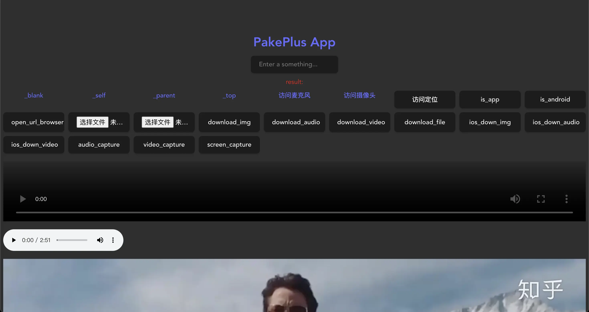

# 测试网站

对于不太清楚 PakePlus 可以实现哪些操作的朋友，可以访问我们的在线测试网站，里面包含了桌面端和移动端两个页面，页面中有很多已经实现的代码，可以作为参考，比如如何访问摄像头、如何访问麦克风、如何访问位置、如何下载文件、如下写入文件等。  
测试站的源代码可以下载参考：[https://self.pakeplus.com/PakePlusDemo.zip](https://self.pakeplus.com/PakePlusDemo.zip)

## 桌面端测试站

测试站：[https://pphtml.pages.dev/](https://pphtml.pages.dev/)

桌面端测试站是包含了桌面端常用 api 的测试网站，可以将这个网站填入到打包地址中，测试是否能正常运行

## 移动端测试站

测试站：[https://pphtml.pages.dev/app](https://pphtml.pages.dev/app)

移动端测试站包含了移动端常用的 api 测试网站，可以测试移动端的功能，例如访问相册、相机、摄像头、位置等

