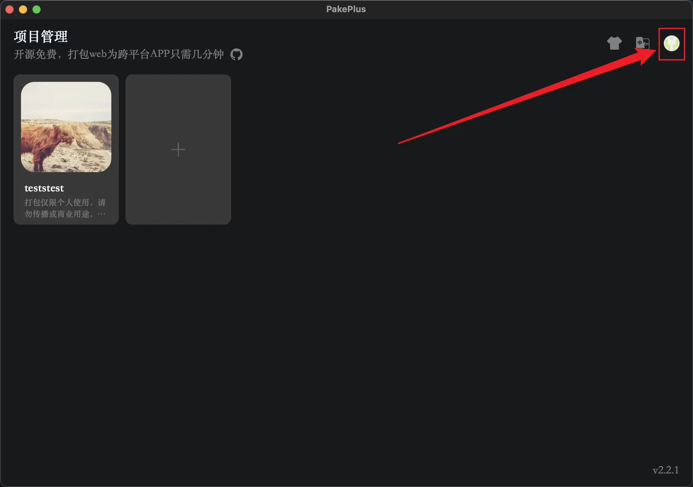
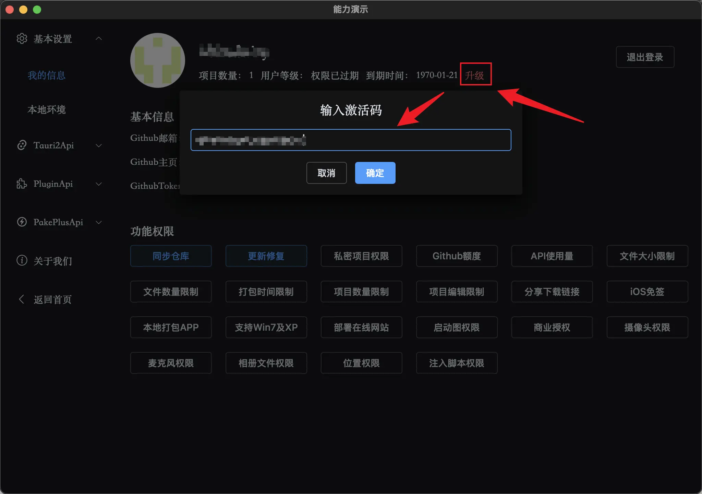
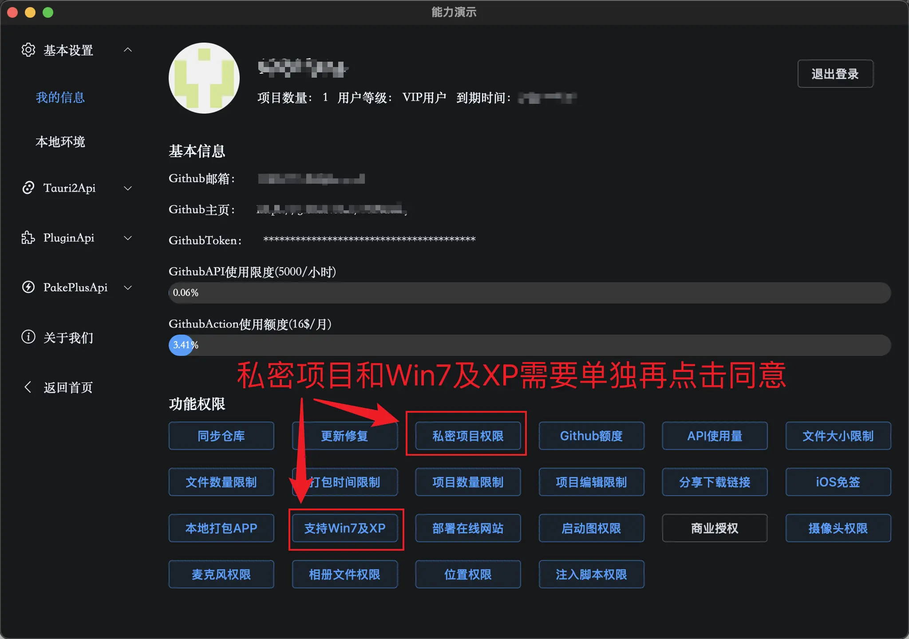
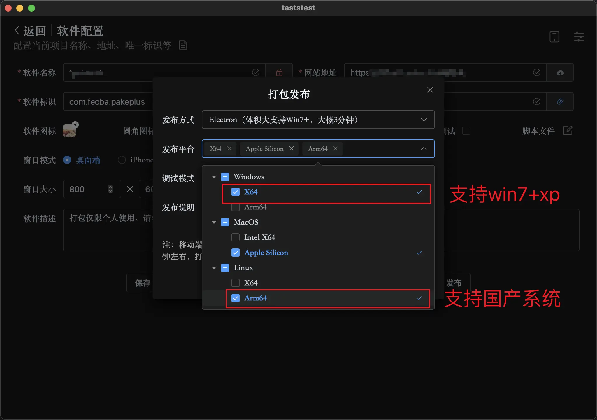

# 感恩回馈

PakePlus 是 Github 开源项目，大部分功能都是免费的，开发和维护以及解决 bug 需要花费大量的时间和精力。感谢您的支持以及为了感恩赞助者，赞助后通过邮箱或微信联系我们，即可为您开通更多使用权限，开通的权限包括：私密项目、增加项目数量、取消时间限制、ios 免签、分享下载、支持 Win7 和绿色免安装版本、支持配置 APP 启动图等等。

如果你对 PakePlus 任意仓库有所贡献，又或者在网络平台上发视频或者文章宣传过 PakePlus，都可以联系我们，我们会根据你所做的贡献和宣传来为你开通更多使用权限，感谢对 PakePlus 的认可。

## 激活码

拿到激活码之后，到 PakePlus 软件首页右上角，点击头像进入 我的信息 页面:

然后点击升级按钮，填入激活码：

私密项目以及 Windows7 和 xp 等国产 Linux Arm 系统支持需要再单独点击同意才可以使用：

私密项目：打包的内容会存储在你的 Github 私密仓库中，只有你自己可以访问，别人无法看到。  
支持 Win7 和 xp：可以支持打包 Electron 版本，并且支持 Windows7 系统以及国产 Linux Arm 系统，发布时候选择 Electron 版本即可：

## 注意

私密项目打包后，只能本地下载，不支持分享下载链接。  
ios 免签只支持打包在线网站，不支持静态文件，不支持 APP 更多配置，不支持启动图配置，不支持注入脚本。  
Electron 版本中不支持使用 Tauri 和 PakePlus 的 api，更多配置中有些配置还不生效。
